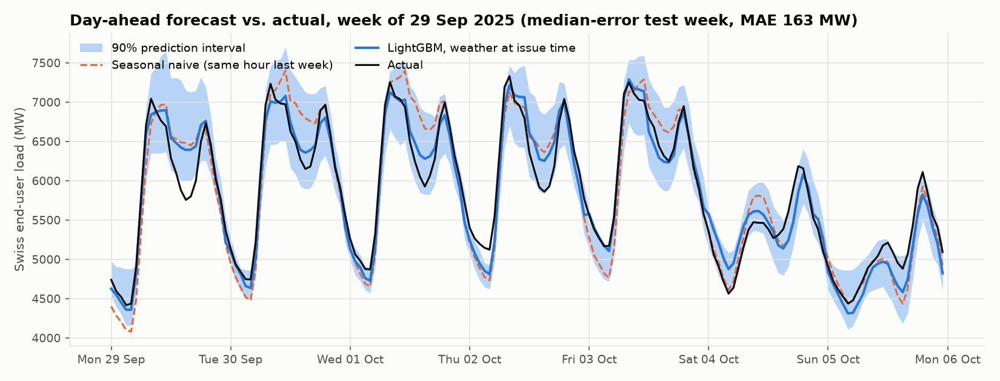
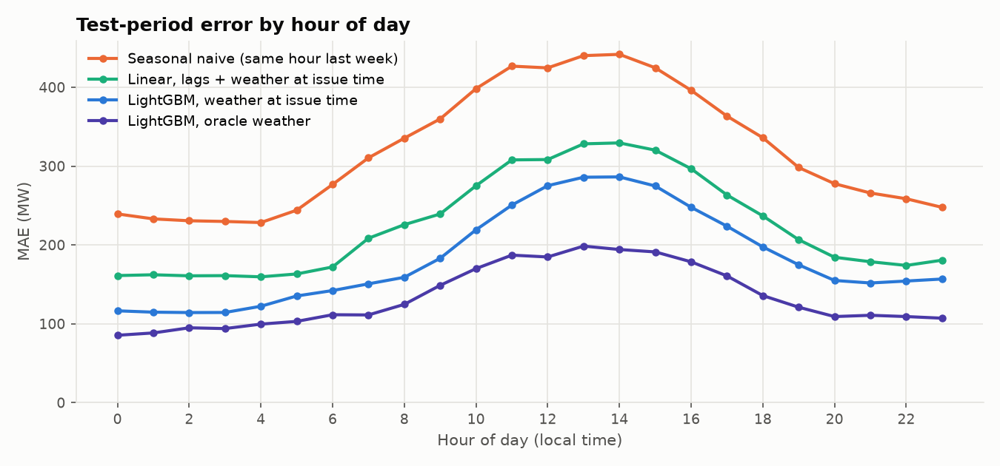
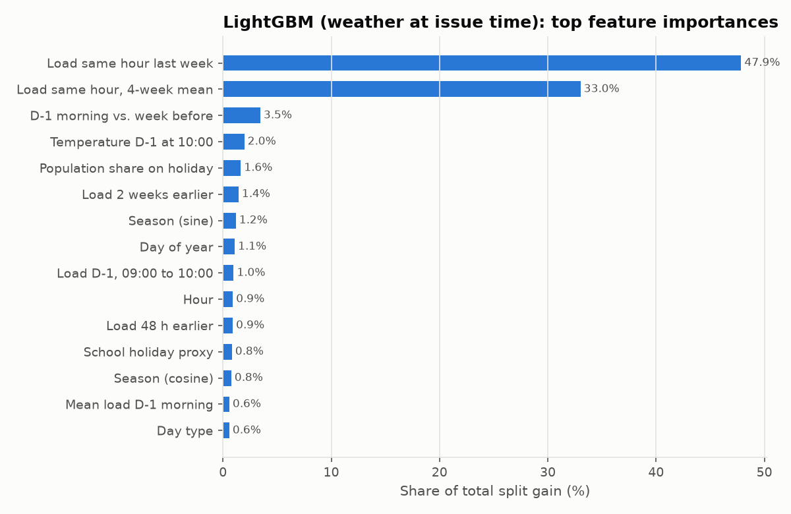
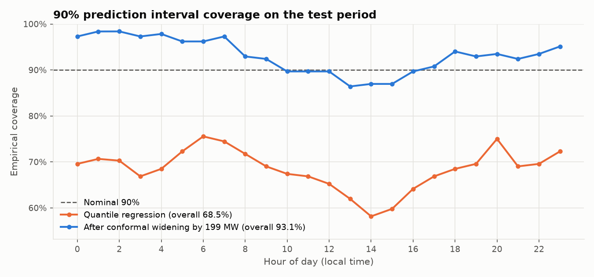
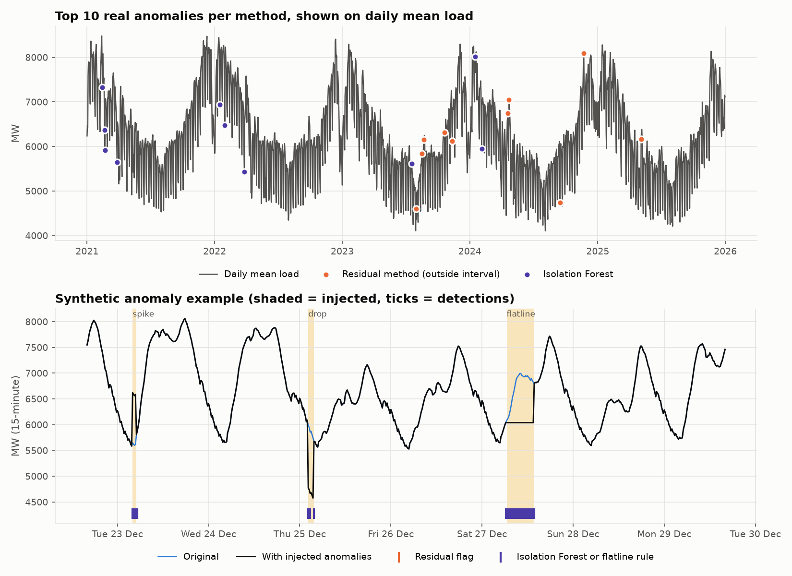

# Swiss day-ahead load forecasting and anomaly detection

Day-ahead forecasts of hourly Swiss electricity consumption, with calibrated prediction intervals and two complementary anomaly detectors, built on public Swissgrid and Open-Meteo data. The pipeline is fully reproducible (`make all` or one `docker run`) and every number below comes from `reports/`.

*Kurzfassung auf Deutsch: [README.de.md](README.de.md). Model card: [MODEL_CARD.md](MODEL_CARD.md).*

## The problem

A utility has to nominate tomorrow's energy by late morning today. Errors cost money in balancing energy, and unusual consumption (a cold snap, a bridge day, a failing meter feed) needs to be spotted quickly and explained. This project models that task at national level:

* **Forecast:** at 10:00 local time on day D-1, predict all 24 hourly values of Swiss end-user load for day D (a horizon of 14 to 38 hours).
* **Detect:** flag periods where consumption is unusual, and separate real behaviour from data problems.

## Data

| Source | What | Resolution | Period |
|---|---|---|---|
| [Swissgrid, Energieübersicht Schweiz](https://www.swissgrid.ch/en/home/operation/grid-data/generation.html) | Total energy consumed by end users in the Swiss control block (kWh per 15 min, converted to MW) | 15 min | 2021-01-01 to 2025-12-31 |
| [Open-Meteo historical weather API](https://open-meteo.com/en/docs/historical-weather-api) | 2 m temperature, global (shortwave) radiation for 8 locations | hourly | 2020-12 to 2025-12 |
| [`holidays`](https://pypi.org/project/holidays/) package | Public holidays for all 26 cantons | daily | 2020 to 2026 |

**Weather** is aggregated into one national series using population weights: each location stands for a group of cantons, weighted by approximate 2023 resident population (BFS, rounded to thousands; the numbers are in `config.yaml`). Resulting weights: Zurich 0.230, Bern 0.218, Lausanne 0.135, St. Gallen 0.124, Lucerne 0.099, Basel 0.096, Geneva 0.059, Lugano 0.040.

**Holidays** are encoded as the *share of the Swiss population* that has a public holiday that day, summed over cantons with the same population weights. 1 August scores 1.0, 26 December 0.69, 1 May 0.43 and Corpus Christi 0.29. A day counts as a holiday above 0.5. This handles the patchwork of cantonal holidays better than a national on/off flag. Bridge days (a working day between a holiday and a weekend) and a simple school-holiday proxy (Easter, summer, autumn and Christmas windows) are derived from it.

**Data validation** (`reports/data_validation.md`): every file is checked for header, unit (`kWh`), non-numeric cells, duplicates, gaps and plausible range, and daylight-saving days are converted explicitly (92 and 100 quarter hours). The result is a gap-free grid of 175,296 quarter hours with no missing, duplicate or out-of-range values. One real pitfall turned up: **the labelling convention of the Swissgrid files changes in 2025.** Files for 2021 to 2024 label each quarter hour by its end (`00:15` to `00:00`); the 2025 file (and the 2026 file) labels by its start (`00:00` to `23:45`). A naive parser shifts the whole of 2025, including the test period, by 15 minutes. The pipeline detects the convention per file and reports it; details are in [docs/swissgrid_structure.md](docs/swissgrid_structure.md).

## Approach

**No leakage by construction.** Every load feature is computed relative to the issue time (D-1, 10:00 local): lags of at least 48 hours, the same hour one to four weeks back, the mean of day D-2, and the D-1 morning up to 10:00. Unit tests corrupt all data after the issue time (including on both daylight-saving days) and assert that no feature changes.

**Two weather settings, clearly separated:**

* *Weather at issue time:* only weather observed before 10:00 on D-1. This is what a deployable model without a weather forecast feed could use.
* *Oracle weather:* the observed weather on day D. This is **not available** at forecast time and is reported only as an upper bound for what a perfect weather forecast would add.

**Models**, all compared against the same baselines:

| Name | Description |
|---|---|
| Seasonal naive | Same hour one week earlier |
| Linear, calendar only | Ridge regression on hour by day-type, month, holidays, bridge days, season |
| Linear, lags + weather | The same plus all lag and issue-time weather features |
| LightGBM, no weather | Gradient boosting on calendar and lag features |
| **LightGBM, weather at issue time** | **Main model**, plus issue-time weather |
| LightGBM, oracle weather | Upper bound, plus observed weather on day D |

**Validation:** rolling-origin cross-validation with an expanding window, 8 quarterly folds from July 2023 to June 2025, never a random split. The **test period (July to December 2025, 4,417 hours)** was held out and used once, after all modelling choices were fixed on the development data.

**Prediction intervals:** LightGBM quantile regression for the 5/95% and 10/90% quantiles, then a split-conformal correction whose margin is estimated on the cross-validation predictions only.

## Results

Held-out test period, July to December 2025 (hourly MW; mean load about 6,000 MW):

| Model | MAE (MW) | RMSE (MW) | MAPE | CV MAPE (mean ± std, 8 folds) |
|---|---:|---:|---:|---:|
| Seasonal naive | 320 | 453 | 5.2% | 6.2 ± 1.4% |
| Linear, calendar only | 315 | 404 | 5.3% | 6.4 ± 0.9% |
| Linear, lags + weather at issue time | 225 | 290 | 3.7% | 4.0 ± 0.6% |
| LightGBM, no weather | 192 | 261 | 3.1% | 3.7 ± 0.6% |
| **LightGBM, weather at issue time** | **184** | **251** | **3.0%** | **3.5 ± 0.5%** |
| *LightGBM, oracle weather (upper bound)* | *134* | *183* | *2.2%* | *2.6 ± 0.3%* |

What this says, plainly:

* **The main model cuts the error of the seasonal naive baseline by 43%** (MAE 320 to 184 MW) and beats the linear model with the same features in all 8 CV folds and on the test set (18% lower MAE).
* **Most of the gain comes from well-designed lag and calendar features, not from the algorithm.** The linear model with the same inputs is already at 3.7% MAPE. If simplicity and transparency matter more than the last 0.75 percentage points of MAPE, it is a reasonable choice.
* **Weather known at 10:00 on D-1 adds little** (MAE 192 to 184 MW, about 5%). Oracle weather lowers MAE by a further 27%, so **a real numerical weather forecast feed is the most valuable next input.** An operational model would land somewhere between the two.
* **Holidays, Saturdays and Mondays are hardest.** Test MAPE is 3.9% on holidays (only 3 holiday days in the test period, so treat this as indicative), 3.6% on Saturdays and 3.5% on Mondays, versus 2.9% on normal working days. The seasonal naive baseline fails badly on holidays (15.9%). Errors peak around midday (figure 2), which is consistent with uncertainty from solar generation behind the meter and weather.


*Figure 1. A typical test week (the week with the median weekly error), with the 90% prediction interval.*


*Figure 2. Test error by hour of day.*


*Figure 3. The model relies mostly on the load at the same hour one week and four weeks back, then on recent level changes, temperature and holidays.*

**Intervals.** Raw quantile regression under-covers: the nominal 90% interval contains 80% of CV hours and 83% of test hours. The split-conformal correction (+109 MW on each side, estimated on CV only) brings test coverage to **92.3%** with a mean width of about 1,000 MW. Coverage is lowest around midday (85% at 13:00), so intervals should ideally be widened by hour.


*Figure 4. Empirical coverage of the 90% interval by hour, before and after the conformal correction.*

## Anomaly detection

Three complementary checks run on the quarter-hour data:

1. **Residual method:** the oracle-weather model's 5 to 95% interval (observed weather is legitimately available after the fact). An hour is flagged when the load lies outside the interval by more than 0.62 interval widths; this threshold flags 1% of hours in the cross-validation predictions. Interval widths are floored at 200 MW for scoring.
2. **Isolation Forest** on engineered 15-minute features: level, first difference, 1-hour rolling standard deviation, deviation from the median of the same quarter hour 1 to 3 weeks earlier, deviation from a local rolling median, time of day, weekend. The threshold is set so that 0.2% of training quarter hours are flagged.
3. **Flatline rule:** four or more identical consecutive quarter hours, a standard plausibility check for frozen meters or stalled data transfers.

**Evaluation by injection.** A copy of the test period gets 40 synthetic anomalies (10 each of spikes of +15 to 30% over 15 to 60 minutes, drops of 20 to 40%, level shifts of 8 to 15% over 2 to 12 hours, and flatlines of 2 to 8 hours), repeated for 5 random seeds. Forecast features are rebuilt from the corrupted data, as they would be in production. Mean over seeds:

| Method | Event recall | Spikes | Drops | Level shifts | Flatlines | Event precision | Point precision | Point recall |
|---|---:|---:|---:|---:|---:|---:|---:|---:|
| Residual | 0.55 | 0.40 | 0.72 | 0.66 | 0.40 | 0.71 | 0.68 | 0.34 |
| Isolation Forest | 0.75 | 1.00 | 1.00 | 1.00 | 0.00 | 0.50 | 0.49 | 0.13 |
| Flatline rule | 0.25 | 0.00 | 0.00 | 0.00 | 1.00 | 1.00 | 0.95 | 0.36 |
| All three combined | 1.00 | 1.00 | 1.00 | 1.00 | 1.00 | 0.61 | 0.71 | 0.70 |

*Event recall: share of injected events with at least one flagged quarter hour. Event precision: share of flagged runs that overlap an injected event. Unlabelled real anomalies in the test period count as false positives, so precision is a lower bound.*

The methods really are complementary. The Isolation Forest finds every short, sharp event but misses flatlines entirely: a frozen value lies inside the range seen in training, so it is not "isolated". The residual method is diluted by hourly aggregation for 15-minute spikes but catches sustained deviations with the highest precision. The deterministic flatline rule is perfect on flatlines and nothing else. **Transparency note:** the Isolation Forest alarm budget was first set to 1%, which produced about 95 false alarm events in six months; it was lowered to 0.2% after seeing that result. Recall was unchanged and event precision rose from 0.26 to 0.50.


*Figure 5. Top: the ten largest real anomalies per method (residual method covers July 2023 onwards, where out-of-sample forecasts exist). Bottom: an injected example in the Christmas week.*

**Largest real anomalies and plausible explanations** (full lists in `reports/anomalies.md`). These are hypotheses consistent with the data, not verified causes.

* **Sudden cold spells in spring and late autumn** account for the biggest residuals: 19 and 22 April 2024 (+9% and +13% for most of the day; national mean temperature 3 to 5 °C against 12 to 16.5 °C a week earlier), 5 May 2025 (+17% around midday at 8 °C with very low radiation after days at 17 °C), and 21 to 22 November 2024 (+13% at midday, around 0 °C and very dull). The model under-reacts because its lag features still reflect the warmer previous week. On the November days, snow covering rooftop solar may have added to the midday excess; that is not checked here.
* **The late-August 2023 heatwave** (17 and 22 to 25 August 2023, +6 to +9%, population-weighted temperatures up to 33 °C in the data): such heat is rare in the training data, so cooling demand is underestimated.
* **Bridge days:** 31 July 2023 (the Monday before the national holiday, 15% below forecast) and 10 May 2024 (the Friday after Ascension, 12% below). Bridge days are flagged as a feature but have few training examples.
* **Unexplained:** Sunday 15 September 2024 afternoon (14% below forecast, the Federal Day of Prayer, which falls on a Sunday anyway). There is no obvious explanation in these data.
* **Data-quality signals:** no gaps, duplicates or flatlines were found in 2021 to 2025. The Isolation Forest's top flag is a single quarter hour on 19 July 2023 at 17:45 that is 438 MW above its neighbours before returning immediately, which looks more like a measurement or aggregation artefact than real demand. Its other top flags are steep dusk ramps on winter weekends and steps of about 300 MW right after the spring clock change, which are plausibly real (for example load control on local time) but worth a check with the data owner.
* **COVID-19:** the data start in 2021 and the residual method only covers July 2023 onwards, so this analysis says nothing reliable about pandemic effects.

## Limitations

* **National aggregate only.** Swissgrid end-user consumption is a net, grid-level quantity; behind-the-meter solar lowers it on sunny days. A distribution utility forecasts much smaller, noisier and more PV-affected loads.
* **No weather forecasts.** The deployable model sees only past weather; the oracle model is an upper bound, not an achievable result.
* **Approximate weights and proxies.** Population weights are rounded and assigned to eight locations; the school-holiday proxy uses fixed windows rather than cantonal calendars.
* **One test period.** Six months (July to December 2025) with three holidays. Results for spring or for rare events are less certain.
* **Data vintage.** Values are as downloaded on 29 September 2026 (SHA-256 hashes in `data/raw/manifest.json`); Swissgrid may revise published data.
* **Synthetic anomalies are idealised.** Real meter and communication failures are messier than injected spikes and flatlines.

## What I would do next with smart meter or grid data

* **Add numerical weather forecasts** (for example MeteoSwiss or ECMWF) with forecast archives, to replace the oracle gap with a real, measured gain.
* **Forecast at substation or customer-segment level** and reconcile hierarchically to the supply area, since that is where grid and procurement decisions are made.
* **Model behind-the-meter PV, heat pumps and EV charging** explicitly, using installed capacity registers and irradiance forecasts, because they drive the midday and winter errors seen here.
* **Turn the anomaly checks into a VEE (validation, estimation, editing) step** for meter data, with per-meter baselines, the flatline rule for stalled transfers, and a feedback loop where operators label alarms to tune thresholds.
* **Monitor in production:** track rolling error and interval coverage by hour and day type, retrain on a schedule, and alert on drift.

## Reproduce

Requirements: Python 3.12+ and [uv](https://docs.astral.sh/uv/). On macOS, LightGBM needs OpenMP (`brew install libomp`).

```bash
uv sync
make data        # download (about 125 MB) and validate; writes reports/data_validation.md
make train       # rolling-origin CV and final fit (about 5 minutes on a laptop)
make evaluate    # metrics, breakdowns, coverage, figures 1 to 4
make anomalies   # anomaly detection, injection study, figure 5
make test lint typecheck
```

Or with Docker, which runs the whole pipeline:

```bash
docker build -t swiss-load-forecast .
docker run --rm -v "$PWD/data:/app/data" -v "$PWD/reports:/app/reports" swiss-load-forecast
```

If the Swissgrid download fails, `make data` stops and prints the exact URLs and target paths so the files can be downloaded by hand. All settings (dates, locations, weights, model parameters, thresholds) live in `config.yaml`.

## Repository layout

```
config.yaml                   single configuration file
src/swiss_load_forecast/
  download.py                 Swissgrid and Open-Meteo download with manifest
  cleaning.py                 parsing, DST and label handling, validation report
  weather.py                  national weather aggregation
  calendar_features.py        population-weighted holidays, bridge days, school proxy
  features.py                 leakage-safe lag and weather features
  models.py                   baselines, linear and LightGBM models
  evaluation.py               rolling-origin CV, metrics, conformal intervals
  anomaly.py                  residual, Isolation Forest, flatline rule, injection
  plots.py, pipeline.py, cli.py
tests/                        unit tests (features, leakage, cleaning, anomalies) and an end-to-end smoke test
reports/                      metrics, validation report, anomaly lists, figures
docs/swissgrid_structure.md   inspection of the raw workbooks
```

## License

Code: MIT. Data: Swissgrid and Open-Meteo under their respective terms of use; the raw data are not redistributed in this repository.
